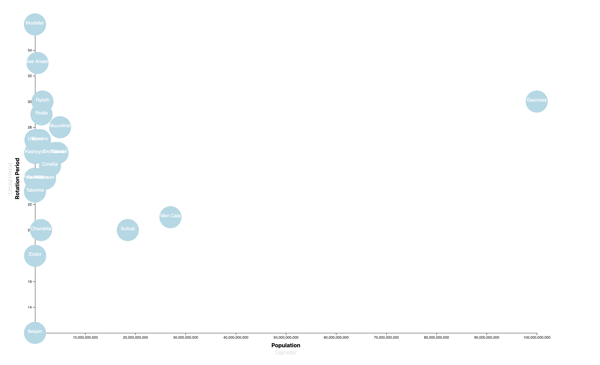
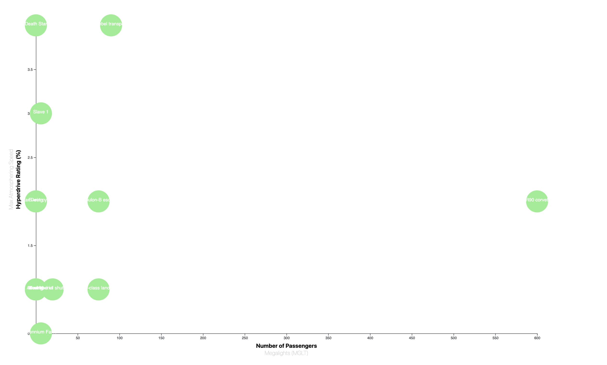
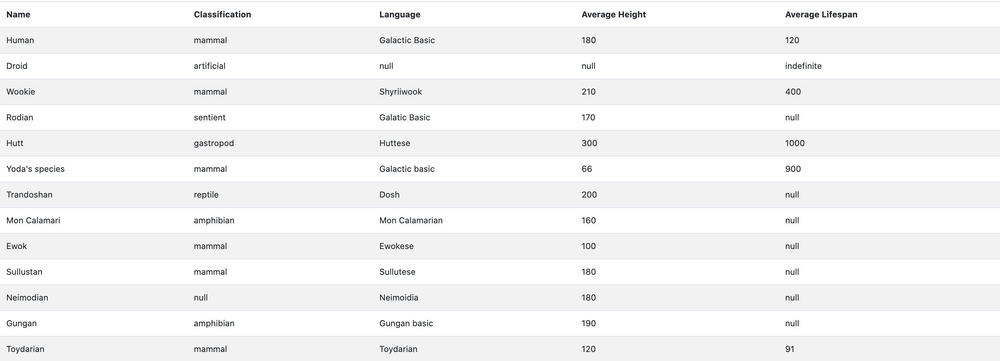
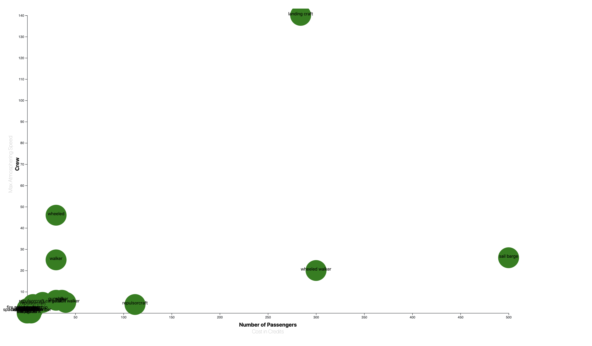

# Project_2
Escaping 2020 on Earth, Time to Move to A Galaxy Far, FAR Away!

	After experiencing the whirlwind that has been the year 2020, our group has decided to search for an alternative home.  Through the examination of planets, species, and climates, as well as an analysis of spacecraft, we will determine the best place to relocate.

Data Sources:  Star Wars API: https://swapi.dev/documentation

Data:

In this project, we used request.get to pull in the data from from the api and used a while loop to get the data from each page of the api. We then converted the data into a csv file. Some of the data was further cleaned to remove rows with unknown values so that when we were creating our scatter graph, we would not run into issues.

Flask:

Flask was used to connect to our csv file, tansform it to jsonify and create routes so that our webpage would be able to pull in all the data for our javascript files. This allows us to be able to access all of our html file and have it load on one website.

Visualizations:

-Planets

In this page we used d3 to create a scatter graph that had changing axis. We also used d3 to create a table to show the planet name, gravity, climate, and terrain. Orbital, rotational, population, and diameter buttons were created so that when they were clicked, a bar graph would display the data of the button clicked.

We recommended, that to escape earth, Cata Neimoidia would be a good planet to move to because it had a low population, not too long of days or years, and a decent climate/terrain.

-Spaceships

We also used d3 in this page to create a table and a scatter graph with changing axis. Buttons were also created similar to the planets page so that the data was shown in a different way. 

We recommended that to get to our new planet, that CR90 Corvette would be the best spaceship to travel on. We chose this spaceship because it wasn't too high in cost of credits, and it could hold a lot of passengers.

-Species

On this page, d3 was used to create a table that displayed information for soecies' name, classification, language, average height, and average lifespan. 

We thought that the Zabrak species would be the best species to travel with and too keep us safe from other aggressive species we might run into.

-Vehicles

On this page, d3 was used to create a scatter graph with changing axis. Number of passengers and cost in credits was compared to crew and max atmospheric speed. 

We recomend that the TIE/LN Starfighter was the best vehicle to travel around on once we are on our new planet. We thought that this would be the best vehicle because of its speed
